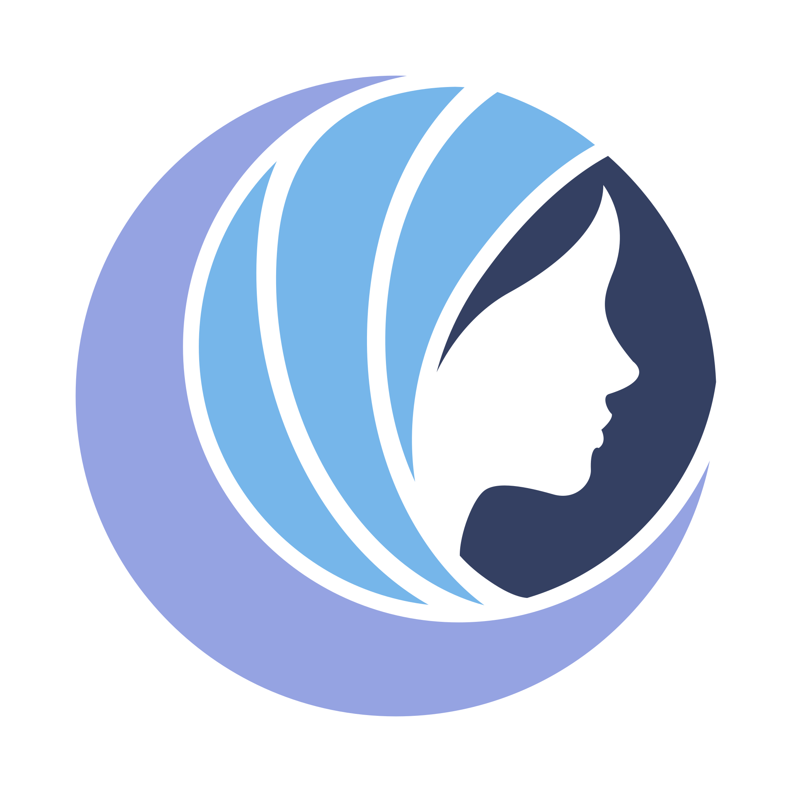

<div align="center">

<br/>

<!-- LOGO BADGE -->


<br/><br/>

# 🌙 Moonveil Studios — Logo Animation

### *An eclipse blooms. A veil descends. Identity revealed.*

<br/>

[](./LICENSE)
[](https://developer.mozilla.org/en-US/docs/Web/HTML)
[](https://tailwindcss.com/)
[](#)
[](#)
[](#)

<br/>



> *Se a imagem acima não carregar, abra o `index.html` diretamente no seu navegador para ver a animação ao vivo.*

<br/>

</div>

---

<br/>

## ✦ O que é isso?

**Moonveil Studios Logo Animation** é uma página web standalone — **zero dependências externas** além de um CDN do Tailwind — que exibe a identidade visual do estúdio com uma sequência de animações CSS artesanais.

A logo é composta inteiramente por **SVG puro**, e cada elemento entra em cena com sua própria personalidade: a lua cai do éter como se rompesse um véu de névoa, a figura emerge da escuridão lateral, e os três véus surgem em cascata com um spring bounce orgânico. Depois que a entrada termina, tudo respira.

<br/>

## ✦ Anatomia da Animação

A sequência foi dividida em **três camadas independentes**, cada uma controlável via toggle na interface:

<br/>

```
┌─────────────────────────────────────────────────────────────────┐
│                    MOONVEIL ANIMATION SYSTEM                    │
├───────────────────┬─────────────────────┬───────────────────────┤
│   .anim-intro     │    .anim-float      │      .anim-glow       │
│   Eclipse Reveal  │  Respiração dos     │   Pulsação da Lua     │
│                   │      Véus           │                       │
├───────────────────┼─────────────────────┼───────────────────────┤
│  Executa uma vez  │  Loop infinito      │  Loop infinito        │
│  ao carregar e    │  (alternate)        │  (alternate)          │
│  ao replay        │                     │                       │
├───────────────────┼─────────────────────┼───────────────────────┤
│  slideLua         │  breatheVeil        │  moonPulse            │
│  slideFigura      │  + stagger 0.8s     │  drop-shadow duplo    │
│  dropVeil ×3      │  por cada véu       │  + rotação 1.5°       │
│  (staggered)      │                     │                       │
└───────────────────┴─────────────────────┴───────────────────────┘
```

<br/>

### 🌒 `Eclipse Reveal` — Entrada da Logo

| Elemento | Animação | Duração | Delay | Easing |
|---|---|---|---|---|
| 🌕 Lua | Cai do topo + desfoca para dentro | `1.5s` | `0s` | `cubic-bezier(0.2, 0.8, 0.2, 1)` |
| 🧍 Figura | Desliza da direita | `1.2s` | `0.6s` | `cubic-bezier(0.2, 0.8, 0.2, 1)` |
| 🟦 Véu 1 | Cai com spring bounce | `1.0s` | `1.0s` | `cubic-bezier(0.34, 1.56, 0.64, 1)` |
| 🟦 Véu 2 | Cai com spring bounce | `1.0s` | `1.2s` | `cubic-bezier(0.34, 1.56, 0.64, 1)` |
| 🟦 Véu 3 | Cai com spring bounce | `1.0s` | `1.4s` | `cubic-bezier(0.34, 1.56, 0.64, 1)` |

<br/>

### 🌬️ `Respiração dos Véus` — Estado Idle

Os três véus flutuam em **movimento assíncrono** usando `animation-delay` escalonado (`0s`, `0.8s`, `1.6s`), criando a ilusão de tecido vivo movendo-se no vento. Cada ciclo dura `3.5s` em modo `alternate`, fazendo o movimento de ida e volta suave e natural.

<br/>

### ✨ `Pulsação da Lua` — Brilho Vivo

A lua pulsa entre dois estados de `drop-shadow`, com um glow suave em `rgba(149, 163, 226, 0.5)` expandindo para um brilho mais intenso em `0.8` de opacidade com uma segunda camada difusa. Uma rotação sutil de `1.5°` adiciona vida orgânica ao movimento.

<br/>

## ✦ Estrutura do Projeto

```
moonveil-logo/
├── 📁 src                 ← Só uma pasta para organizar, gostastes?
  ├── 🏞️ moonveil.svg      ← Logozinha. Fim.
├── 📄 index.html          ← Tudo. É só isso. Sem build. Sem node_modules.
├── 📄 README.md           ← Você está aqui
└── 📄 LICENSE             ← Licença de direitos autorais que ninguém lê e viola mesmo assim, sugiro
                              que leia, seu infame.
```

<br/>

## ✦ Como Rodar

Não tem nada para instalar. Sério.


```bash
# Clone o repositório
git clone https://github.com/ArkGrayer/moonveil-logo.git

# Entre na pasta
cd moonveil-logo

# Abra no navegador
open index.html        # macOS
start index.html       # Windows
xdg-open index.html    # Linux
```

> Ou simplesmente arraste o `index.html` para qualquer aba do navegador. Funciona offline, sem servidor, sem nada.

<br/>

## ✦ Requisitos

> **Existir**

<br/>

## ✦ Paleta de Cores

<br/>

<div align="center">

| Papel | Hex | Preview |
|---|---|---|
| Lua / Brilho | `#95a3e2` |  |
| Véus | `#76b6ea` |  |
| Figura Feminina | `#344062` |  |
| Fundo Principal | `#020617` |  |
| Superfície UI | `#0f172a` |  |
| Accent Índigo | `#6366f1` |  |

</div>

<br/>

## ✦ Técnicas Utilizadas

- **`transform-box: fill-box` + `transform-origin: center`** — garante que rotações e escalas em SVG partam do centro geométrico de cada path, não do viewport inteiro.
- **`will-change: transform, opacity, filter`** — promove os paths animados para camadas compostas na GPU, evitando repaint.
- **`cloneNode(true)` para replay garantido** — recriar o nó SVG no DOM é a forma mais confiável de reiniciar animações CSS sem recorrer a hacks de `animation-name: none`.
- **`requestAnimationFrame` + `setTimeout`** — o rAF garante um frame de "pausa" antes de re-adicionar a classe de animação; o timeout sincroniza as animações idle com o fim da entrada.
- **Easing Spring (`cubic-bezier(0.34, 1.56, 0.64, 1)`)** — simula um overshoot físico nos véus, como se caíssem e quicassem levemente ao pousar.

<br/>

## ✦ Compatibilidade

| Navegador | Suporte |
|---|---|
| Chrome / Edge 88+ | ✅ Total |
| Firefox 90+ | ✅ Total |
| Safari 14+ | ✅ Total |
| Opera 74+ | ✅ Total |
| IE 11 | ❌ Não suportado |

> `filter: drop-shadow()` em SVG requer navegadores modernos. IE não suporta e nunca vai suportar. Isso é intencional.

<br/>

## ✦ Licença

```
MIT License — faça o que quiser com isso.
Sem obrigação de créditos. Sem restrições comerciais.
```

[](./LICENSE)

<br/>

---

<div align="center">

<br/>

*Feito com obsessão por detalhes e amor pelo ofício.*

<br/>


<br/>

</div>
